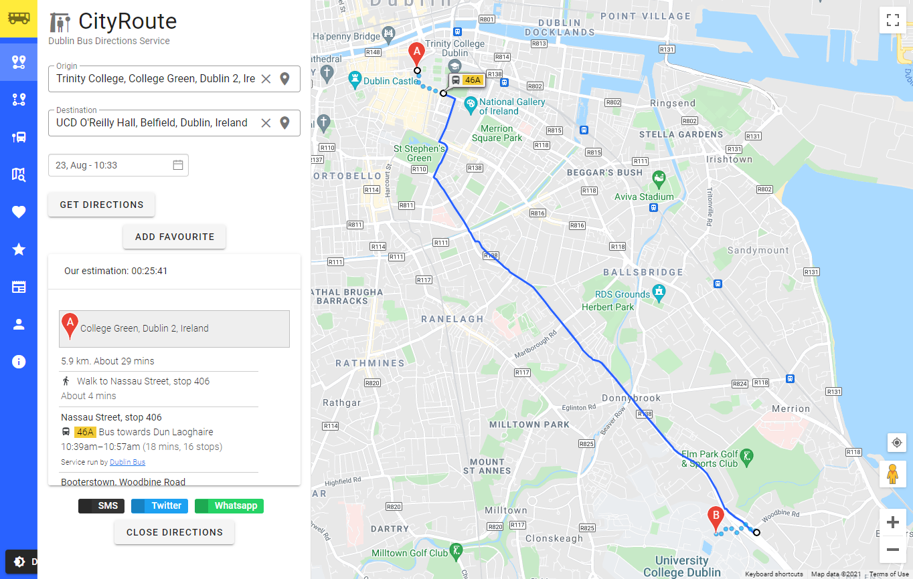
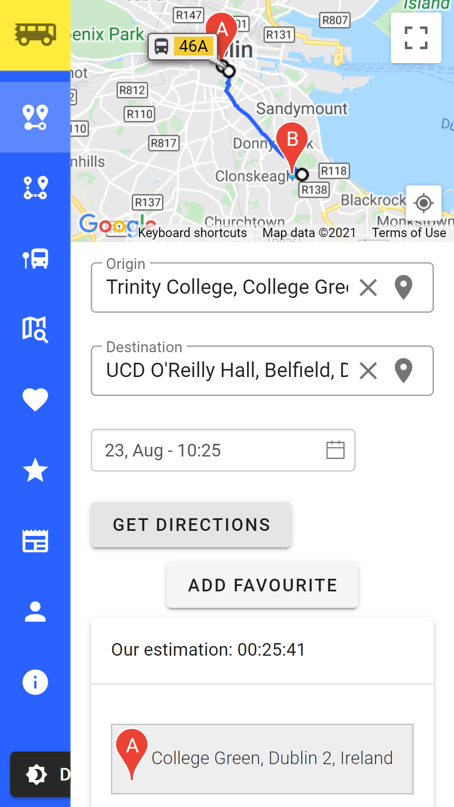
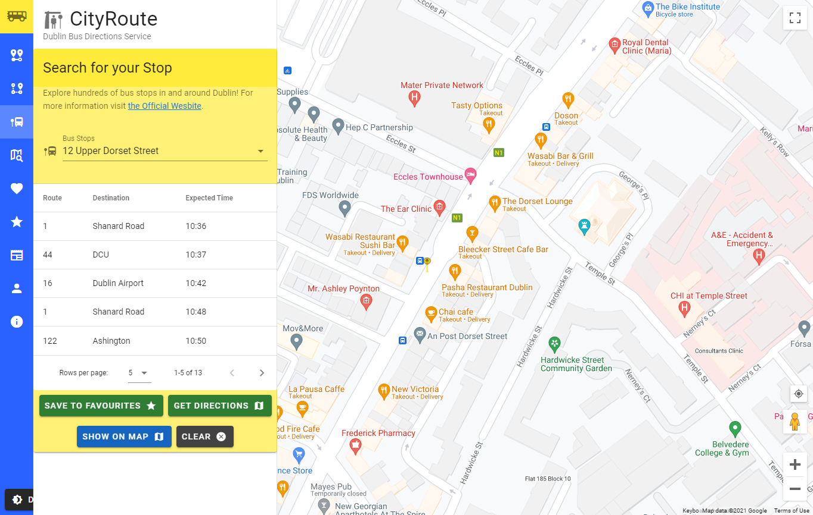
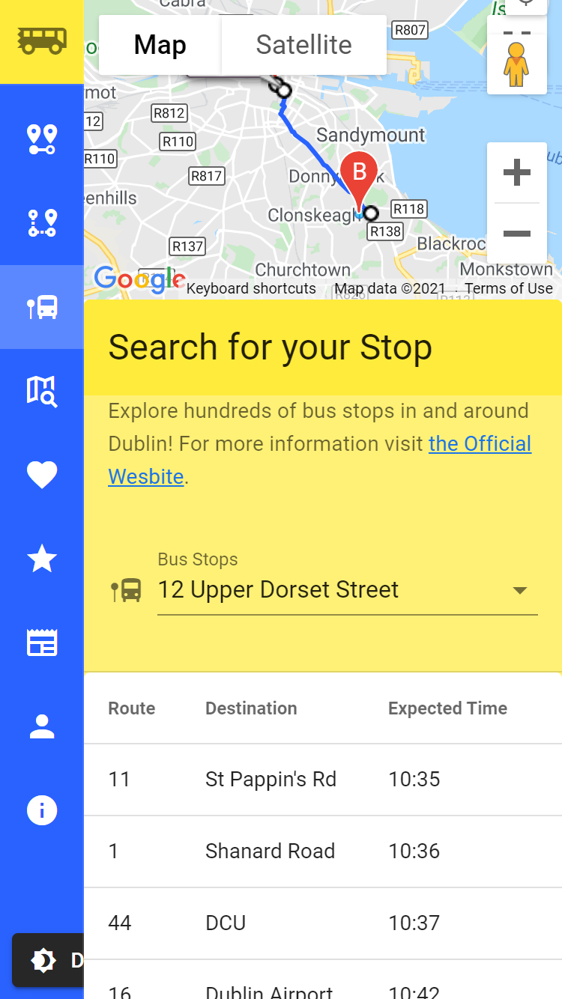
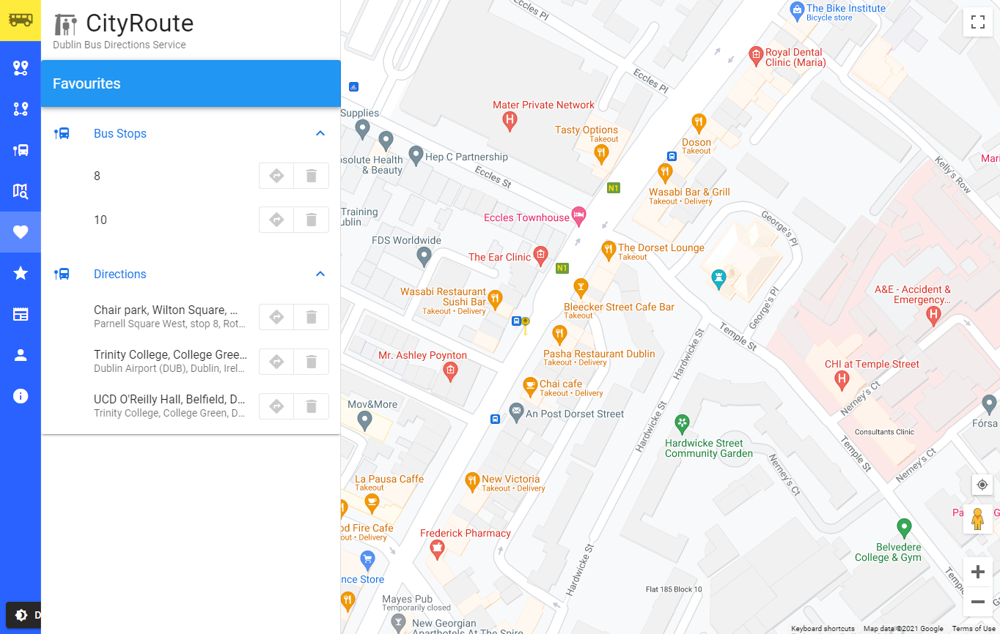
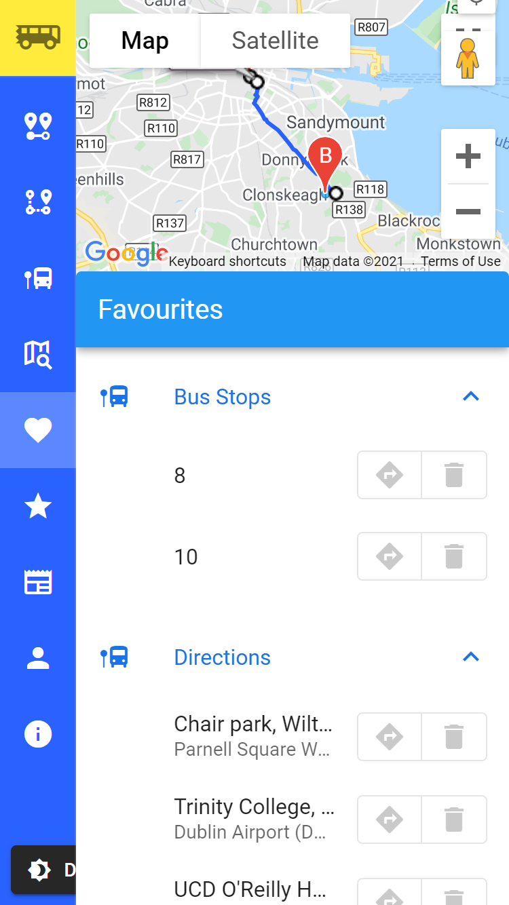
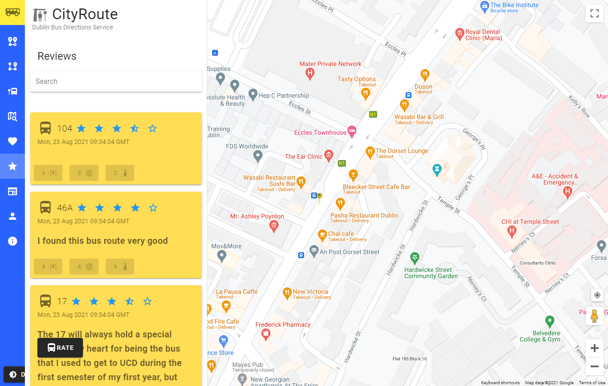
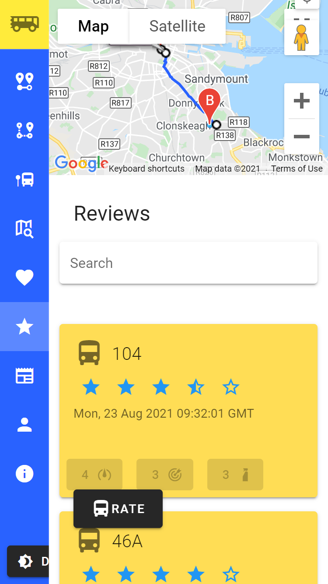
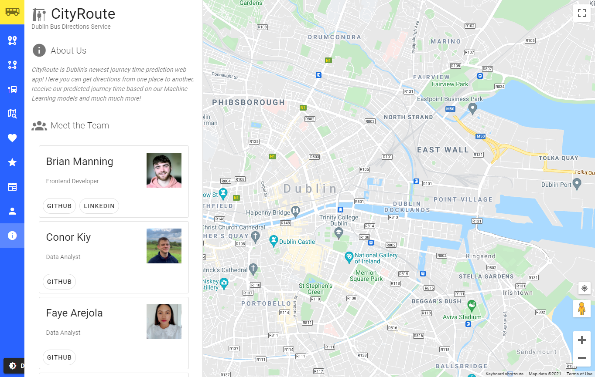
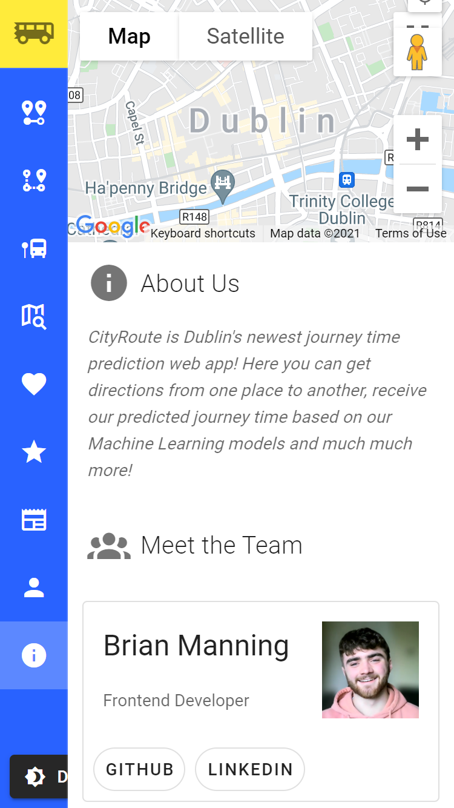

<!--
*** Thanks for checking out the Best-README-Template. If you have a suggestion
*** that would make this better, please fork the repo and create a pull request
*** or simply open an issue with the tag "enhancement".
*** Thanks again! Now go create something AMAZING! :D
-->

<!-- PROJECT SHIELDS -->
<!--
*** I'm using markdown "reference style" links for readability.
*** Reference links are enclosed in brackets [ ] instead of parentheses ( ).
*** See the bottom of this document for the declaration of the reference variables
*** for contributors-url, forks-url, etc. This is an optional, concise syntax you may use.
*** https://www.markdownguide.org/basic-syntax/#reference-style-links
-->

<!-- [![Contributors][contributors-shield]][contributors-url]
[![Forks][forks-shield]][forks-url]
[![Stargazers][stars-shield]][stars-url]
[![Issues][issues-shield]][issues-url]
[![MIT License][license-shield]][license-url]
[![LinkedIn][linkedin-shield]][linkedin-url] -->

<!-- PROJECT LOGO -->
<br />
<p align="center">
  <a href="https://cityroute.ml">
    
  </a>

  <h3 align="center">CityRoute Web Application</h3>

  <p align="center">
    Built with Vue.js and Django REST Framework.
    <br />
    <a href="https://github.com/othneildrew/Best-README-Template"><strong>Explore the docs »</strong></a>
    <br />
    <br />
    <a href="https://cityroute.ml">View Live Website</a>
    ·
    <a href="https://github.com/CityRoute/Web-App-CityRoute/issues">Report Bug</a>
    ·
    <a href="https://github.com/CityRoute/Web-App-CityRoute/issues">Request Feature</a>
  </p>
</p>

<!-- TABLE OF CONTENTS -->
<details open="open">
  <summary>Table of Contents</summary>
  <ol>
    <li>
      <a href="#about-the-project">About The Project</a>
      <ul>
        <li><a href="#built-with">Built With</a></li>
      </ul>
    </li>
    <li>
      <a href="#getting-started">Getting Started</a>
      <ul>
        <li><a href="#prerequisites">Prerequisites</a></li>
        <li><a href="#installation">Installation</a></li>
      </ul>
    </li>
    <li><a href="#usage">Usage</a></li>
    <li><a href="#roadmap">Roadmap</a></li>
    <li><a href="#contributing">Contributing</a></li>
    <li><a href="#license">License</a></li>
    <li><a href="#contact">Contact</a></li>
    <li><a href="#acknowledgements">Acknowledgements</a></li>
  </ol>
</details>

<!-- ABOUT THE PROJECT -->

## About The Project

[![CityRoute Screen Shot][product-screenshot]](https://cityroute.ml)

### Built With

This section should list any major frameworks that you built your project using. Leave any add-ons/plugins for the acknowledgements section. Here are a few examples.

- [Vue.js](https://vuejs.org/)
- [Django REST Framework](https://www.django-rest-framework.org/)

GETTING STARTED


## Getting Started

To get a local copy up and running follow these simple example steps.

### A. Prerequisites

You must have the following before the installation stage below.

- npm

  See here: npmjs.com/get-npm

  ```sh
  npm install npm@latest -g
  ```

- Python (Python 3.6)

### B. Installation

1. Clone the repo
   ```sh
   git clone https://github.com/CityRoute/Web-App-CityRoute.git
   ```
2. cd into the cloned directory
   ```sh
   cd Web-App-CityRoute
   ```
3. Install NPM packages
   ```sh
   yarn install
   ```
4. Install pip requirements & activate pipenv shell
   ```sh
   pipenv install --dev && pipenv shell
   ```
   If you get errors at this step, you may need to install Python 3.6 and point pipenv to this Python version's .exe like so
   ```sh
   pipenv install --python 'C:\YourPythonDirectory\python.exe' --dev && pipenv shell
   ```

### C. Running the application

1. Serve the frontend
   ```sh
   yarn serve
   ```
2. Serve the backend. Note: You must be in pipenv shell at this point.
   ```sh
   python manage.py runserver
   ```
3. Access the frontend application from http://localhost:8080/
4. Access the backend api from http://localhost:8000/

Now the frontend and backend will automatically refresh when changes are saved to their files.

<!-- USAGE EXAMPLES -->

## Usage & Features

### Journey Planner
Plan your journey and get your journey time estimation using our Machine Learning models. Share the journey with your friends using the buttons below or add it to your favourites to save for later!

<p float="left">
  
   
</p>

### Stop Finder
Find the stop you need and get the times buses will be arriving to it. Get directions to your stop and save it to your favourties!

<p float="left">
  
   
</p>

### Favourites
View your previously saved favourite journey, stops & routes and click on them to get directions!

<p float="left">
  
   
</p>

### Review your Route!
Leave a review for a route you recently travelled on so other passengers know what to expect!

<p float="left">
  
   
</p>

### About Us
Take a look at our about us page to see who we are!

<p float="left">
  
   
</p>

<!-- ROADMAP -->

## Roadmap

See the [open issues](https://github.com/CityRoute/Web-App-CityRoute/issues) for a list of proposed features (and known issues).

<!-- CONTRIBUTING -->

## Contributing

Contributions are what make the open source community such an amazing place to be learn, inspire, and create. Any contributions you make are **greatly appreciated**.

1. Fork the Project
2. Create your Feature Branch (`git checkout -b feature/AmazingFeature`)
3. Commit your Changes (`git commit -m 'Add some AmazingFeature'`)
4. Push to the Branch (`git push origin feature/AmazingFeature`)
5. Open a Pull Request

<!-- LICENSE -->

## License

Distributed under the MIT License. See `LICENSE` for more information.

<!-- CONTACT -->

## Contact

- Brian Manning [(manningb)](https://github.com/manningb) [brian.manning@ucdconnect.ie](mailto:brian.manning@ucdconnect.ie)
- Stephanie O'Neill
- Faye Arejola
- Conor Kiy


Project Link: [https://github.com/CityRoute/Web-App-CityRoute](https://github.com/CityRoute/Web-App-CityRoute)

<!-- ACKNOWLEDGEMENTS -->

<!-- ## Acknowledgements -->

<!-- - [GitHub Emoji Cheat Sheet](https://www.webpagefx.com/tools/emoji-cheat-sheet)
- [Img Shields](https://shields.io)
- [Choose an Open Source License](https://choosealicense.com)
- [GitHub Pages](https://pages.github.com)
- [Animate.css](https://daneden.github.io/animate.css)
- [Loaders.css](https://connoratherton.com/loaders)
- [Slick Carousel](https://kenwheeler.github.io/slick)
- [Smooth Scroll](https://github.com/cferdinandi/smooth-scroll)
- [Sticky Kit](http://leafo.net/sticky-kit)
- [JVectorMap](http://jvectormap.com)
- [Font Awesome](https://fontawesome.com) -->

<!-- MARKDOWN LINKS & IMAGES -->
<!-- https://www.markdownguide.org/basic-syntax/#reference-style-links -->

[contributors-shield]: https://img.shields.io/github/contributors/othneildrew/Best-README-Template.svg?style=for-the-badge
[contributors-url]: https://github.com/othneildrew/Best-README-Template/graphs/contributors
[forks-shield]: https://img.shields.io/github/forks/othneildrew/Best-README-Template.svg?style=for-the-badge
[forks-url]: https://github.com/othneildrew/Best-README-Template/network/members
[stars-shield]: https://img.shields.io/github/stars/othneildrew/Best-README-Template.svg?style=for-the-badge
[stars-url]: https://github.com/othneildrew/Best-README-Template/stargazers
[issues-shield]: https://img.shields.io/github/issues/othneildrew/Best-README-Template.svg?style=for-the-badge
[issues-url]: https://github.com/othneildrew/Best-README-Template/issues
[license-shield]: https://img.shields.io/github/license/othneildrew/Best-README-Template.svg?style=for-the-badge
[license-url]: https://github.com/othneildrew/Best-README-Template/blob/master/LICENSE.txt
[linkedin-shield]: https://img.shields.io/badge/-LinkedIn-black.svg?style=for-the-badge&logo=linkedin&colorB=555
[linkedin-url]: https://linkedin.com/in/othneildrew
[product-screenshot]: readme/video.gif
